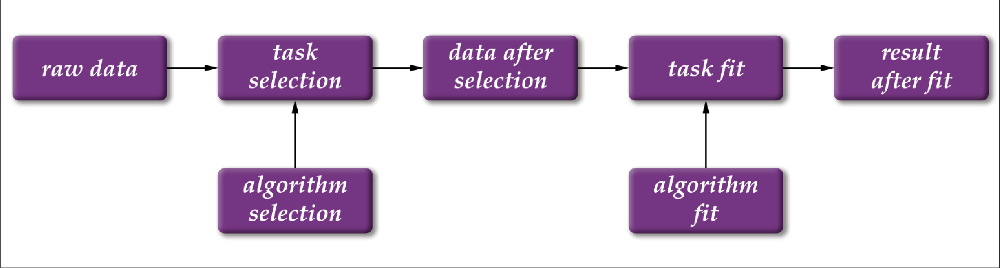

.. Chern documentation master file, created by
   sphinx-quickstart on Sat Jul 15 19:59:40 2017.
   You can adapt this file completely to your liking, but it should at least
   contain the root `toctree` directive.

Chern documentation
====================
The source code and the demo can be found in `github`__ .
Welcome to contribute.

.. __: https://github.com/hepChern
The Chinese version of the document can be found `here`__ .

.. __: http://chern.readthedocs.io/zh_CN/latest/

Introduction
---------
An article `A proposed solution for data analysis management in high energy physics`__ 
will be uploaded to arxiv. In the article, we introduce the .
Here, we would like to introduce the problem we face in the every-day data analysis work.
And we would also like to define a best practice to do analysis together with Chern.

Problems
~~~~~~~~
+ Code would be changed once and once again.
+ Software version change with time.
+ Knowledge transfer.
+ Collaborative work.
+ Input data.
+ Continuous change of directory structure.
  It is never possible to contruct the whole analysis perfectly 
  in the first time. The architecture of the analysis will change
  by time.

Best practice
~~~~~~~~
It is possible to manage the whole analysis and . However, Human makes mistakes.
It is quite hard to remember the .
The Chern toolkit is designed to resolve the difficulty of analysis preservation.

As 
+ Use docker bases provided officially.
+ A stable input data.

To do this with Chern, we introduce a few concepts:
+ object: there are two types of object, one is called algorithm and another is called task.
  The algorithm defines the code and the . The task contains the 
+ Impression: Impression is the core concept of Chern. a impression is a version of algorithm and task. For algorithm, the impression is
  uniquely defined by its contents. However, for task, the impression is defined by itself 
  but also the algorithm it use, and the its inputs. If the inputs/algorithm have a new impression,
  the task should also have a new impression.

The real stuff to do with chern:
+ make algorithms, make tasks, link them together, submit them to the background and chern will 
  automatically run for you.

We separate the .

In the data analysis, the usual case is that we should process the data using different program one by one.
However, with the progress of the experiment, we need to contienous update the models and the parameters.
The update usually makes our program and our data more dirty and more messeous.
This project is intended to provide a tool to manage the projects and make our analysis and make a more comfortable life.

The following is added after the presentation of Sebastian Neubert at LHCb Analysis and Software Week, on July 18th, 2017. The purpose is to explain the idea and the design of this project and invite more human power to the project.

As for analysis preservation, I recommend to force the users to use git and write readme of their analysis.
The best way to force them to do so is to rewrite the shell. And make every shell command recorded by git.
However, it is impossible to create a new shell use for HEP. I recommend to use IPython as the shell and modify 
the functions of `mkdir`, `mv`, `rm`, `cp` etc.

Design philosophy of Chern
---------

   Workflow of a demo analysis (made by Shunan Zhang)

Abstract workflow:
~~~~~~~~
The concept of workflow is similar with that of the most pipeline tools. 
An typical analysis is modeled as a workflow.
The data, task and algorithm can be modeled as some virtual object called VObject.
The VObjects are linked by their relationships.
The basic idea of Chern is to manage this flow.
In the figure above, the "raw data" is processed by a VTask called "task selection" and generate VData called "data after selection". The VTask "task selection" use an VAlgorithm "algorithm selection". The VData "data after selection" is further processed by an VTask called "task fit", which uses "algorithm fit" and generates data file called "result after fit". The specific mean of VData, VTask and VAlgorithm will be explained as following.

+ VData: The concept of data seems straight forward. However, here data include also the plots and other information generated by a program. And they are not the real data but only the expect input and output of the programs. 
+ VAlgorithm:
+ VTask: 

The algorithm means the code and the compile flow. It seems that snakemake provide a good tool to manage the compile flow.

.. figure:: fig/fig2.png

   Demo analysis structure (mad by Shunan Zhang)

data
selection1_algorithm
selection2_algorithm
fit_algorithm
selection1_task
data_after_selection1
selection2_task
data_after_selection2
fit_task
fit_result

For the purpose of preservation, I recommend to force users to use git lab and write readme.
The best approach to f

Contents:

.. toctree::
   :maxdepth: 2

   installation
   startup
   schedule
